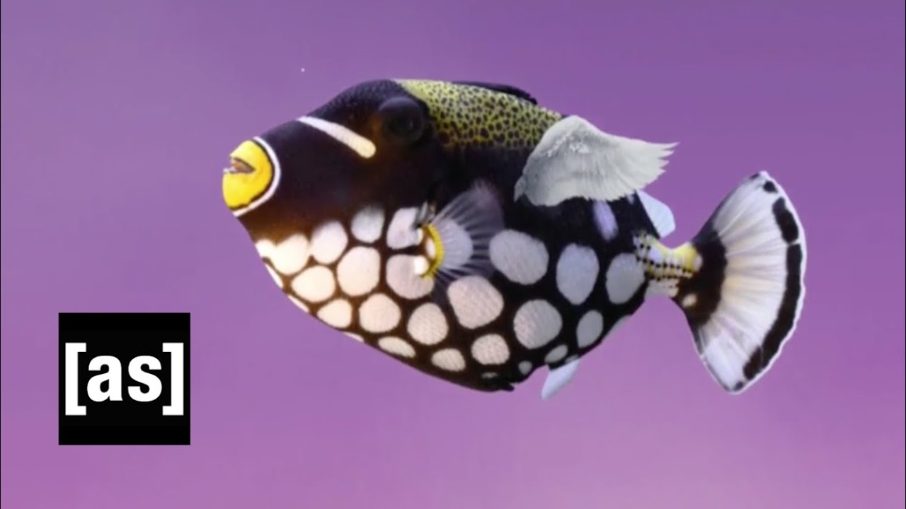

# fishtank

### Editting process 

- edit file

- git status

- git add 'file name' - adds file to the commit 

- git status - check 

- git commit -m "test edit in line 3"  -m (means message)

- git push - pushes local commits to server 

"github tracks what you push and git tracks what you commit" - Reid 

____________________________________________________

Hello it is me Reid

_____________________________________________________

### Branches 

- git checkout -b "branchname" - creates a new branch "branchname"

- git checkout "branchname" - switches branches

- git pull - syncs the local branch with github (whatever is commited)
- merge conflicts - added lines in the same location in local as another branch merge  

- git stash - use when you want to record the current 
state of the working directory and the index, but want to go back to a clean working directory
- clean directory - first state before the last commit
- directory == commits 

mariko local - made edits to local main file 

